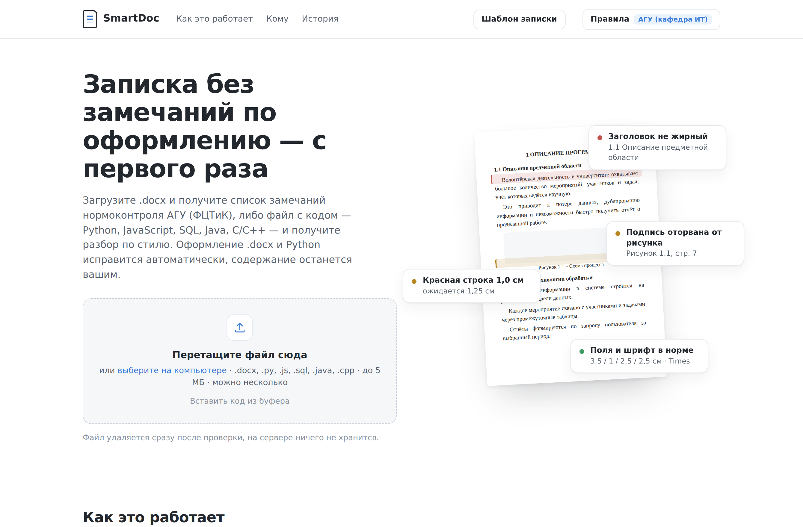
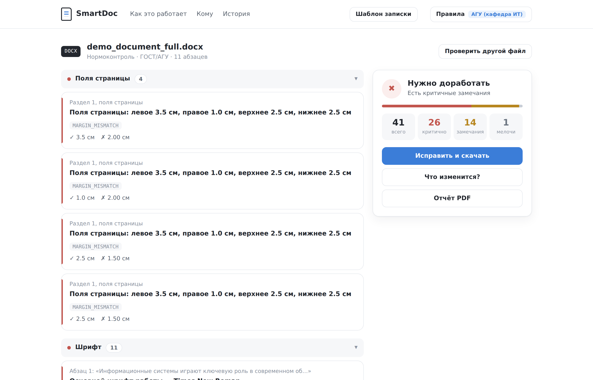
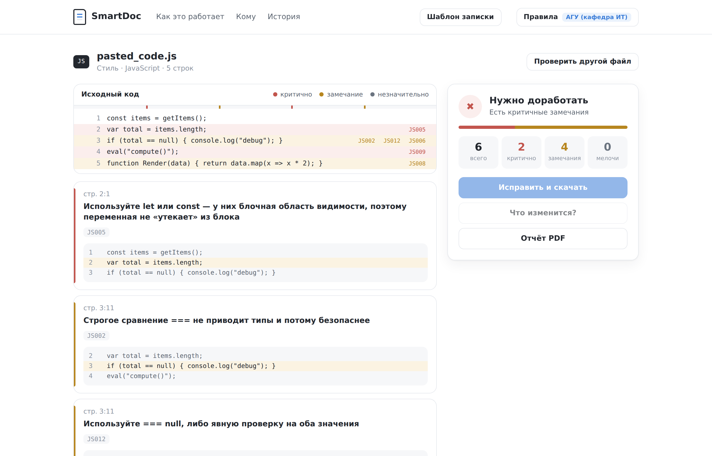
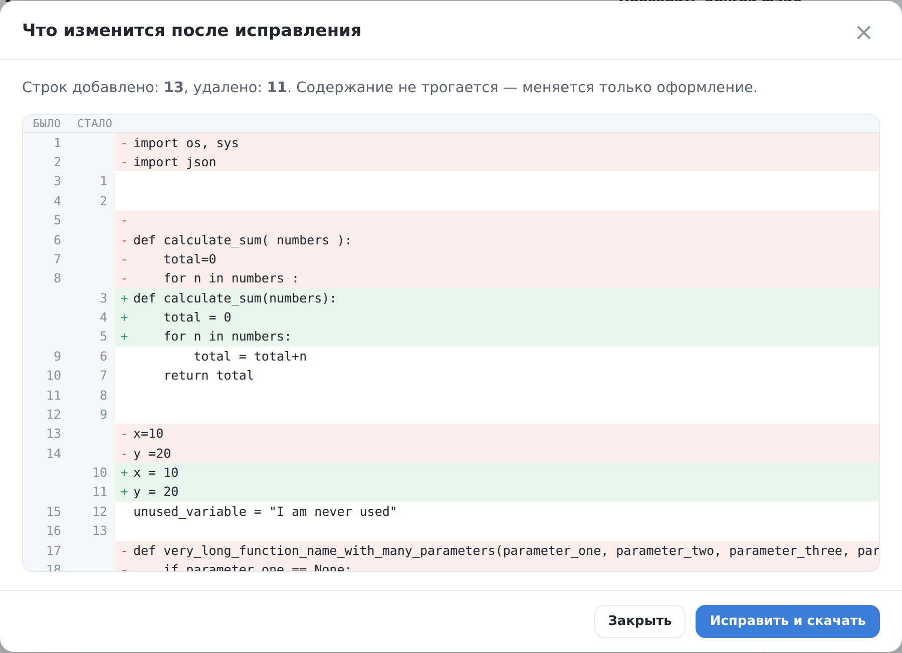

<div align="center">

# SmartDoc &amp; Code Review

**Нормоконтроль пояснительной записки и проверка кода — в браузере, без регистрации**

Загрузите `.docx` — получите список замечаний по требованиям кафедры с точным указанием места.<br>
Загрузите код — получите разбор по стилю. Оформление исправится автоматически, содержание останется вашим.

[](https://github.com/poncikovdanila/SmartDoc-Code-Review/actions/workflows/ci.yml)


[](LICENSE)

</div>



## Зачем это

Работы возвращают с нормоконтроля из-за полей, интервалов и подписей к рисункам — вещей, которые
не имеют отношения к содержанию, но отнимают по несколько заходов. Преподаватель тратит время на
проверку кегля вместо проверки сути.

SmartDoc находит такие замечания за секунды и приводит оформление в порядок, **не трогая текст,
титульный лист и структуру документа**. Файл удаляется сразу после проверки — на сервере ничего
не хранится, регистрации нет.

Правила по умолчанию — требования АГУ им. В. Н. Татищева (ФЦТиК, направление 09.03.02), но они
настраиваются: шрифт, кегль, поля и интервалы задаются под любую кафедру, набор можно сохранить
и выгрузить в JSON.

## Возможности

### Нормоконтроль .docx

Проверяется 38 видов замечаний. Каждое замечание указывает, **где** оно найдено, **что**
ожидалось и **что есть на самом деле**.

| Группа | Что проверяется |
|---|---|
| Текст | шрифт, кегль, межстрочный интервал, красная строка, выравнивание по ширине |
| Страница | поля, нумерация страниц, лишние пустые строки и разрывы |
| Заголовки | полужирное начертание, точка в конце, последовательность нумерации |
| Объекты | подписи к рисункам и таблицам, отрыв подписи от объекта, шрифт внутри таблиц |
| Источники | наличие списка литературы, формат записей, год издания, гиперссылки |



### Проверка кода — пять языков

| Формат | Чем проверяется | Автоисправление |
|---|---|---|
| `.py` | flake8 — pycodestyle + pyflakes, описания ошибок на русском | да |
| `.js` | `var`, `==`, `eval`, `debugger`, забытый `console.log`, именование функций | — |
| `.sql` | регистр ключевых слов, `SELECT *`, `DELETE`/`UPDATE` без `WHERE` | — |
| `.java` | PascalCase классов, camelCase методов, пустой `catch`, отладочный вывод | — |
| `.cpp` `.c` `.h` | `using namespace std`, `goto`, `malloc`, стандартный заголовок в кавычках | — |

Чекеры для JS, SQL, Java и C/C++ встроенные — не нужны ни Node.js, ни JDK, достаточно
`pip install`. Перед применением правил из строки вычищаются строковые литералы и комментарии,
поэтому `var` в комментарии или `SELECT *` внутри кавычек замечанием не считаются.

Ошибки подсвечиваются прямо в исходном коде, рядом с каждым замечанием показан фрагмент с
соседними строками, по миникарте справа можно перейти к нужному месту.



### Автоисправление с предпросмотром

Прежде чем что-то менять, можно посмотреть результат. Для кода — построчный diff с колонками
«было» и «стало», для `.docx` — сколько замечаний снимет исправление и каких именно.



Исправление `.docx` работает по принципу «трогать только отклонения»: текст, титульный лист,
колонтитулы, разрывы страниц и закладки остаются как были.

### И ещё

- **Пакетная проверка** — несколько файлов за один раз, сводная таблица по каждому
- **Вставка из буфера** — `Ctrl+V` прямо на странице, без создания файла
- **Отчёт в PDF** — со фрагментами кода рядом с каждым замечанием
- **Шаблон записки** — готовый `.docx` по текущим правилам, чтобы начать без ошибок
- **История проверок** — последние 30 в браузере, ничего не уходит на сервер

## Быстрый старт

```bash
git clone https://github.com/poncikovdanila/SmartDoc-Code-Review.git
cd SmartDoc-Code-Review
pip install -r requirements.txt
python run.py
```

Откройте <http://127.0.0.1:8000>

## Как устроено

FastAPI отдаёт одну страницу и набор JSON-эндпоинтов. Фронтенд — без фреймворков и сборки:
один HTML, один CSS, один JS. Проверки полностью на сервере, файлы обрабатываются во временной
папке и удаляются в `finally`.

```
app/
├── main.py                    # FastAPI: все маршруты
├── pdf_export.py              # отчёт в PDF (reportlab)
├── template_generator.py      # шаблон записки по текущим правилам
├── checkers/
│   ├── code_checker.py        # Python: flake8 + русские описания
│   ├── code_fixer.py          # autoflake + autopep8, 3 прохода
│   ├── multi_lang_checker.py  # JS, SQL, Java, C/C++
│   ├── docx_checker.py        # нормоконтроль + пресеты правил
│   ├── docx_extras.py         # подписи, библиография, доп. проверки
│   └── docx_fixer.py          # автоисправление .docx
├── templates/index.html
└── static/{style.css, app.js}
```

Отчёт по коду и по документу имеет один формат — `filename`, `file_type`, `total_issues`,
`summary`, `verdict`, `issues`, `source_lines`. Благодаря этому интерфейс, экспорт в PDF и
история работают одинаково для всех языков и для `.docx`.

## API

| Метод | Путь | Что делает |
|---|---|---|
| `POST` | `/api/check` | Проверка одного файла → JSON-отчёт |
| `POST` | `/api/check-batch` | Пакетная проверка нескольких файлов |
| `POST` | `/api/autofix` | Автоисправление → готовый файл |
| `POST` | `/api/autofix-preview` | Что изменится: diff для кода, сводка для `.docx` |
| `POST` | `/api/export-pdf` | Отчёт → PDF |
| `POST` | `/api/generate-template` | Шаблон записки по текущим правилам |
| `GET` | `/api/presets` | Пресеты правил для `.docx` |
| `GET` | `/api/languages` | Поддерживаемые форматы и наличие автоисправления |
| `GET` | `/health` | Health-check |

Эндпоинты, работающие с `.docx`, принимают необязательное поле `docx_rules` — JSON с
пользовательскими правилами. Максимальный размер файла — 5 МБ.

Пример:

```bash
curl -F "file=@Записка.docx" http://127.0.0.1:8000/api/check | jq .summary
```

## Разработка

```bash
pip install -r requirements.txt -r requirements-dev.txt

pytest tests/ -q                                   # 358 тестов
flake8 app/                                        # линтер исходников
flake8 --select=E9,F63,F7,F82 tests/ benchmark/    # только настоящие ошибки
```

На каждый push и pull request тесты и линтер прогоняются в GitHub Actions на Python 3.11 и 3.12
— см. [`.github/workflows/ci.yml`](.github/workflows/ci.yml).

Отдельная тема в тестах — **отсутствие ложных срабатываний**: для каждого языка есть «чистый»
файл с ловушками в комментариях и строках, который обязан давать ноль замечаний. Ложное
замечание в учебном инструменте дороже пропущенного: студент перестаёт доверять отчёту.

Точность на реальных работах замеряется скриптом в [`benchmark/`](benchmark/).

## Деплой

Проект готов к развёртыванию на [Render](https://render.com) — настройки берутся из
[`render.yaml`](render.yaml):

1. **New → Web Service**, подключить репозиторий, ветка `main`
2. Переменная окружения `ENV=production` — отключает автоперезагрузку
3. Через 2–3 минуты сервис доступен по публичной ссылке

На бесплатном тарифе сервис засыпает после 15 минут простоя: первый запрос после сна занимает
до 30 секунд.

## Документация

- [Требования нормоконтроля АГУ ФЦТиК](docs/Требования_нормоконтроля_АГУ_ФЦТиК.md) — полное
  описание проверяемых правил с обоснованием
- [`benchmark/README.md`](benchmark/README.md) — как замерить точность на своих файлах

## Лицензия

[MIT](LICENSE) — можно использовать, изменять и распространять, сохраняя упоминание автора.
Программа поставляется «как есть»: результат проверки носит рекомендательный характер и не
заменяет нормоконтроль кафедры.

## Автор

**Данила Полстянов** — <poncikovdanila@gmail.com><br>
АГУ им. В. Н. Татищева, факультет цифровых технологий и кибербезопасности, 09.03.02, 2026
